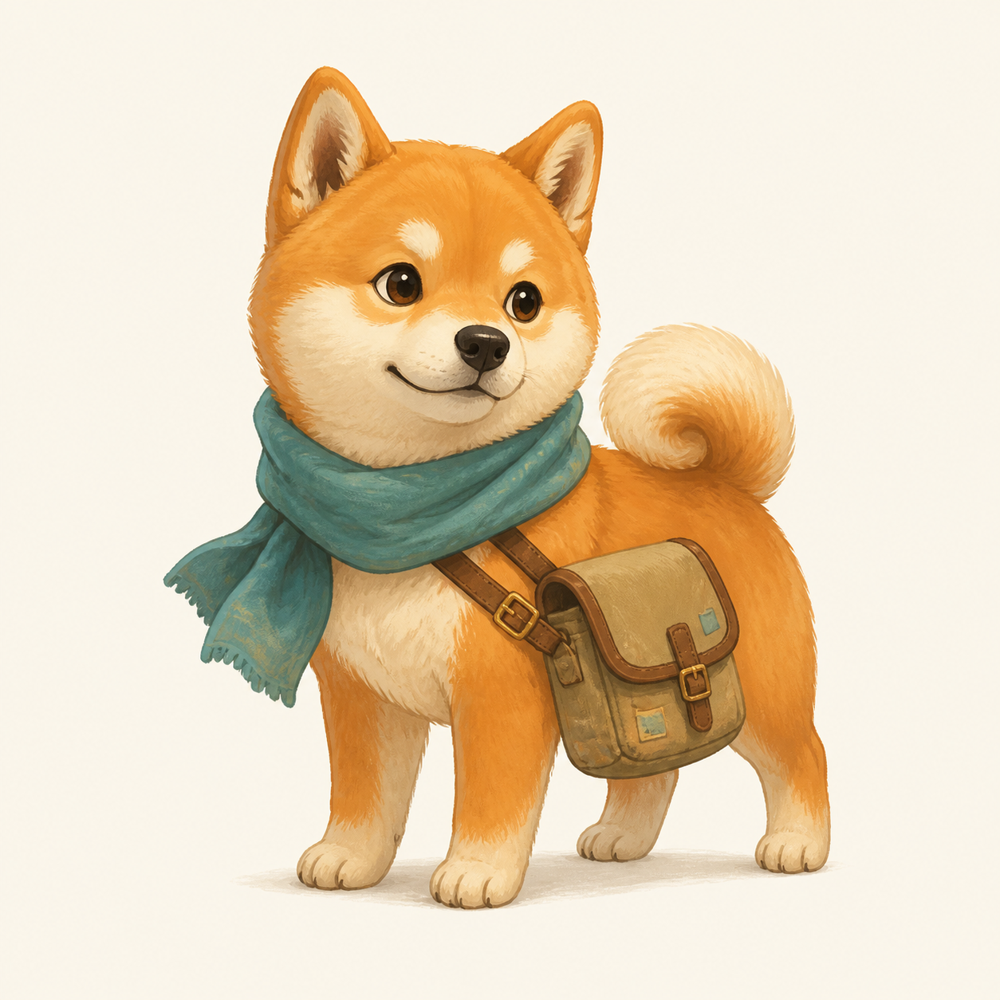
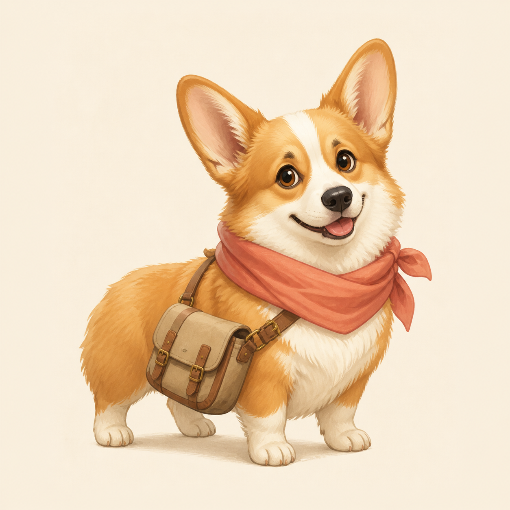
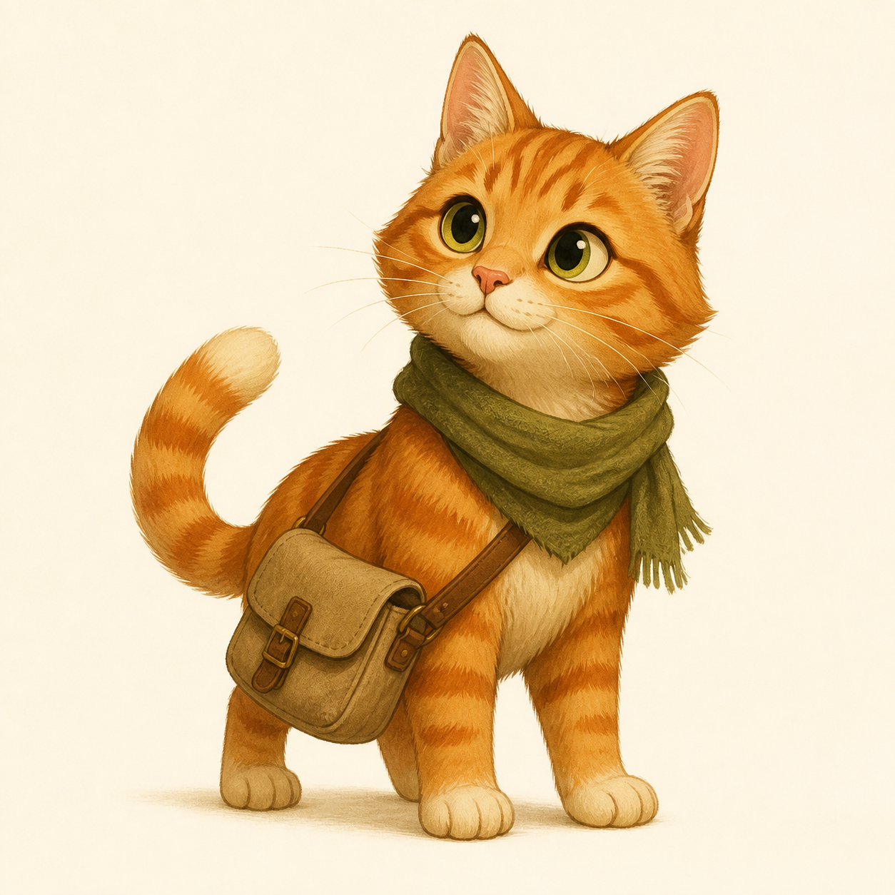
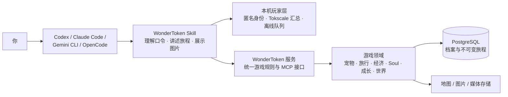

# WonderToken 玩途 🐾

<p align="center"><strong>让消耗过的 Token 变成宠物的远方。</strong></p>
<p align="center">让 Token 不只是花掉的钱，让宠物不只是桌面上的图标。</p>

WonderToken 是一个“旅行青蛙 Agent Skill 版”的虚拟宠物旅行游戏。

如果你已经在 Codex 里养了一只小宠物——那只每天趴在旁边陪你写代码、看着 Agent 干活的小家伙——WonderToken 可以发现并导入它的自定义形象。它不必永远守在桌面角落：现在，它可以背上旅行包，替你去看看代码窗口之外的世界。

你在 Codex、Claude Code、Gemini CLI、OpenCode 等 Agent 中消耗过的 Token，可以换成游戏里的 **玩途币**。宠物会带着这些旅费出发，在真实城市与地标之间旅行，寄回只属于你们的来信，穿过意外开启的时空裂缝，也可能与其他玩家的旅行宠物擦肩而过，并在一次次归家后形成自己的记忆、性格与心愿。

没有网页要打卡，也不用盯着一串数值。你只需要偶尔问一句：

> **“它到哪儿了？”**

然后等一封从远方寄来的信。📮

## 先带上每天陪你工作的那只宠物

在 Codex 中开始领养时，WonderToken 会先寻找当前可用的 **Codex Pet**。如果发现一个或多个自定义宠物，它会把真实候选展示给你，由你决定要不要把熟悉的形象导入旅途。

导入后，它仍然是你认识的那个小家伙，只是多了一段桌面之外的生活：白天陪你看代码，空下来就背着包去远方；下一次你打开 Agent，也许等着你的不是一个静止图标，而是一封它从拉萨、杭州或成都寄回来的信。

Codex Pet 只提供熟悉的外观，旅行中的名字、身高、性格和家园仍由你亲自决定。第一次出发前可以调整，出发后会成为它固定的人生档案。

### 如果暂时没有 Codex Pet

你也可以上传宠物照片制作专属旅行绘本形象，或从六位官方旅行候选中选一位：

| 柴犬 · 向风而行 | 柯基 · 快乐开路 | 橘猫 · 慢慢看世界 |
| :---: | :---: | :---: |
|  |  |  |
| 好奇又温柔，愿意替你认真看看 | 腿不长，兴致很长 | 不赶路，也不漏掉街角的香味 |

| 黑猫 · 夜色观察员 | 垂耳兔 · 温柔探险家 | 小狐狸 · 灵感向导 |
| :---: | :---: | :---: |
|  |  |  |
| 收藏城市不轻易示人的一面 | 有点胆小，也会为重要的人向前 | 总能从寻常街角找到故事入口 |

照片定制需要当前 Agent 具备图片生成能力。没有图片能力也不影响游玩：六个官方形象、旅行来信、Soul 与收藏系统都可以正常使用。

## 它为什么不只是一个聊天角色？

- **熟悉的 Codex Pet 真的能出门**：导入每天陪你工作的自定义宠物，让它从桌面摆件变成拥有旅程、记忆和心愿的伙伴。
- **Token 真的会变成旅费**：通过 Tokscale 汇总本机可读取的历史 Token 用量，只结算尚未兑换过的增量。
- **旅行有真实的时间与路线**：宠物沿确认过的中国大陆城市移动，旅程会留下城市、地标、里程、费用和时间线。
- **每次问候都会留下痕迹**：你询问进展时，系统才结算已经过去的旅程、保存来信和虚拟账单，不会预先写好结局。
- **宠物会慢慢成为“它自己”**：归家后，经历可能沉淀为长期记忆、性格变化、关系与心愿，形成私有的 Soul。
- **世界里不只有你们两个**：500 张偶遇卡覆盖至少 80 座城市，还有 265 项成就等待解锁。
- **旅程会成为可以翻看的东西**：足迹、来信、账单、收藏、纪念图和归家时的成长都会进入档案。

## 三分钟开始试玩

### 1. 准备环境

WonderToken 支持 macOS、Linux 和 Windows，需要：

- Node.js **24.14+（24 LTS）** 与 npm
- 一个支持 Skill、本地命令和网络访问的 Agent

### 2. 安装 Skill

复制当前仓库地址，然后直接对你的 Agent 说：

> **“请帮我安装这个 GitHub 仓库里的 WonderToken Skill：`https://github.com/caichen2333/WonderToken-userskill`。安装完成后重新加载 Skill，并告诉我什么时候可以开始玩。”**

Agent 会根据当前宿主完成安装。公开版 Skill 会连接已经部署好的 WonderToken 公网服务，你不需要理解或配置服务地址，也不需要自己部署服务端、注册 MCP 或安装常驻后台程序。

如果安装过程中需要下载 Skill 自带客户端的锁定依赖，Agent 会正常向你申请权限。完成后重新加载 Skill，或新开一个会话即可。

### 3. 说出第一句话

对 Agent 说：

> **“开始玩途。”**

Agent 会检查旅行信箱是否接通，然后带你完成领养。你需要决定：

- 名字
- 身高
- 1–3 个性格词
- 虚拟家园
- 官方形象或自定义形象

第一次出发前都可以调整；确认出发后，它们会成为这只宠物固定的人生档案。

## 一趟旅程会怎样发生？

### ① 领养：先决定它是谁

优先把你熟悉的 Codex Pet 带进游戏，也可以用参考照片制作专属形象，或选择一只官方宠物。为它取名、描述性格，再选一个家园。系统会确认具体地点，避免把同名城市或地区弄混。

### ② 出发：第一次由世界请客

第一次旅行免费，不需要先兑换玩途币。首旅固定为 **“西藏秋色 10 日自驾环线”**：从拉萨启程，经过巴松措、林芝、羊湖、日喀则、珠峰、萨嘎、班戈和纳木措，再平安归来。

出发时不会提前扣币，也不会立刻生成整趟故事。路线会随着已经经过的旅行时间，逐段写进来信。

当前体验版采用快速时间：

> **现实 10 秒 = 1 个旅行日**

因此首旅最快约 100 秒走完。归家不会在后台突然弹出；等你再次询问进展时，Agent 会把已经发生的旅程整理成来信，并在到达归家节点时完成归档。

### ③ 收信：问一句“到哪儿了？”

当你说“到哪儿了”或“旅行怎么样了”，Agent 会处理从上一封信到现在已经发生的内容：

- 确认实际走过的城市、地标与活动
- 写一封不超过 500 字的旅行来信
- 保存路线、旅行日与虚拟账单
- 在付费旅行中扣除本段实际发生的玩途币费用
- 必要时为宠物保留足够的返程预算

如果你只是想看状态，不希望推进或结算，请明确说：

> **“只查当前位置，不生成新进展。”**

已经保存的旅程不会被后来的对话改写；你的新要求只影响还没有发生的部分。

### ④ 途中陪伴：给未来一点方向

宠物还在路上时，你可以说：

- “接下来省一点。”
- “下一站去成都。”
- “这次想玩满 7 天。”
- “走远一点。”
- “回家吧。”

返程也需要旅行时间，不会瞬间传送。后续旅程默认约 14 个旅行日，你也可以指定精确天数；单趟最多 28 个旅行日。系统会尽量避开已经去过的城市和景点，除非你明确想要重游。

### ⑤ 归家：故事会留下来

宠物归家后，一趟旅行会沉淀为：

- 完整旅行档案与时间线
- 城市、地标、里程和费用统计
- 经验、等级、成就与偶遇收藏
- 一张四宫格或九宫格旅行纪念图（服务图片能力可用时）
- 可能发生变化的 Soul：心情、性格、记忆、关系与心愿

旅程默认私密。只有你明确同意，这一趟的宠物形象与到访轨迹才可能匿名出现在其他宠物未来的偶遇中；主人身份、余额、费用、日记、指令与 Soul 都不会分享。

## 偶遇：穿过时空，也与别人的宠物擦肩

旅行不会只有“到此一游”。当宠物走进一座城市，它可能撞见两种完全不同的不期而遇。

### ⏳ 城市里的时空裂缝

也许是西湖边的雨声忽然被拉长，也许是城墙下的路灯像旧画卷一样一页页翻过去。短暂开启的时空裂缝，会把宠物带进一段与这座城市有关的独立故事：

- 遇见来自不同时代的历史人物，帮他完成一件没有被写进史书的小事
- 走进文学、影视、动画或游戏角色的故事切片，与熟悉的身影合作解决一个轻巧难题
- 认识邮差、植物照料员、声音收藏家、夜灯修补师等原创城市伙伴
- 在未来科技展时空中，用纸带、编码灯、注意力连线等安全比喻，认识大模型技术背后的人与想法

每次时空偶遇都有自己的目标、阻碍和结局。任务完成后，街声与路标重新回到当下，角色留在自己的世界里，宠物则把这段相遇收进来信和收藏卡册。500 张偶遇卡覆盖至少 80 座城市，去过同一个地方，也未必会遇见同一个故事。

### 🐾 另一只宠物留下的旅行回声

如果另一位玩家曾经走过同一座城市，并且明确开放了那趟旅行的匿名轨迹，你的宠物也可能遇见它留下的“旅行回声”。

这不是陌生人实时聊天，也不是公开社区。系统只会让两只宠物知道彼此的名字、形象和已经走完的地点轨迹：它们可能在街角交换一张车票，在风大的观景台互相压住帽子，或结伴走完一小段路，然后继续各自的旅程。主人是谁、说过什么、花了多少钱，以及宠物的 Soul，都不会出现在相遇里。

一次真诚的擦肩会带来成长，也可能成为归家纪念图里最特别的一格；一趟旅程遇见多位伙伴时，还可能留下象征性的旅行回声合影。你也可以在宠物归家后，选择把这一趟轨迹匿名留给后来者——也许某天，别人收到的来信里会写着你的宠物名字。

## 最常用的对话口令

| 你对 Agent 说 | WonderToken 会做什么 |
| --- | --- |
| `开始玩途` | 检查连接，开始领养或恢复现有宠物 |
| `带我的宠物去旅行` | 完成领养确认，或为下一趟旅行做准备 |
| `到哪儿了？` / `旅行怎么样了？` | 推进并保存已经发生的旅程，寄回新来信并结算虚拟账单 |
| `只查当前位置，不生成新进展` | 只读状态，不推进旅行、不生成来信、不扣币 |
| `接下来省一点` / `去……看看` | 调整尚未发生的路线或消费偏好 |
| `回家吧` | 开始一段真实占用旅行时间的返程 |
| `把我历史已消耗的 Token 换成玩途币` | 读取本机可用的 Tokscale 汇总，只兑换未结算的增量 |
| `宠物在想什么？` / `它还记得拉萨吗？` | 查看当前心情、性格、相关记忆与心愿 |
| `查看旅行档案` / `查看终身足迹` | 回看历史旅程、城市和景点 |
| `查看成就` / `查看偶遇收藏` | 打开成长收藏 |
| `分享这趟匿名轨迹` / `关闭分享` | 单独控制某趟已完成旅程的匿名偶遇权限 |
| `玩途使用说明` | 让 Agent 根据当前状态告诉你下一步能做什么 |

## Skill 能力一览

### 🐾 宠物与陪伴

- 领养唯一宠物，并确认名字、身高、性格、家园和固定形象
- 优先发现并导入 Codex 中已有的自定义宠物形象
- 使用六个官方形象，或在图片能力可用时通过照片制作专属形象
- 查看、检索和管理私有 Soul
- 置顶、纠正、补充或忘记一段记忆，管理性格与心愿
- 通过旅行与成就积累经验、提升默契等级

### 🗺️ 旅行与来信

- 首次西藏环线与后续自由旅行
- 指定目的地、精确天数、远近偏好和消费风格
- 基于已过去时间生成可恢复、可归档的旅行进展
- 保存路线、活动、费用、问答与用户指令
- 预算不足时优先保障返程，异常时提供救援归家
- 在已有正式行程和离线许可时记录离线进展，联网后再确认

### 🪙 玩途币

- 汇总本机多个 Agent 可读取的历史 Token 用量
- 跨 Agent 共用同一匿名玩家和钱包
- 只发放尚未结算的增量，重复采集不会重复领币
- 按输入、缓存、输出和推理 Token 的不同权重换算

### 📮 收藏与世界

- 查看旅行档案、时间线与终身足迹
- 收集 500 张城市偶遇卡与 265 项成就
- 穿过城市时空裂缝，遇见历史、文学影视、动画游戏、科技与原创角色
- 与其他玩家匿名开放的宠物旅行回声短暂同行，并留下双宠或多宠纪念瞬间
- 归家时生成旅行统计与纪念图
- 按旅程开启或撤回匿名轨迹分享，默认始终关闭

## 玩途币是怎样换算的？

玩途币来自**已经消耗的历史 Token**，不是把当前 Token 余额转走，也不涉及真实货币支付。

```text
累计应得玩途币 =
⌊(
  输入 Token × 100
  + 缓存写入 Token × 125
  + 缓存读取 Token × 10
  + 输出 Token × 500
  + 推理 Token × 500
) ÷ 100,000⌋
```

换一种更直观的看法：每 1,000 个输入 Token 约对应 1 玩途币；输出与推理 Token 的权重更高，缓存读取的权重更低。系统会按每个来源的历史累计最高值结算，多次运行、切换 Agent 或某个来源暂时不可读，都不会让同一批 Token 重复兑换。

首次兑换时，Agent 可能会请求你的许可，以下载项目锁定版本的 Tokscale；它不需要管理员权限，也不会安装常驻后台进程。首次免费旅行不依赖 Tokscale，可以先玩再换币。

`1 玩途币 = 1 元人民币等值旅行预算` 只是游戏里的叙事尺度，方便理解交通、住宿和吃饭的花费，不代表真实价格、付款或旅行建议。

## 系统是怎样工作的？



这套架构有三个重要分工：

1. **Agent 负责陪伴感**：理解你的自然语言、写旅行来信、呈现图片与选择。
2. **服务端负责游戏事实**：确认地点、锁定路线、结算钱包、保护返程、保存档案、发放成长与成就。Agent 不能靠讲故事凭空加钱或改写历史。
3. **本机负责身份与用量采集**：同一台电脑、同一系统用户下的多个 Agent 共用一只宠物；Tokscale 在本机汇总后，只把来源级 Token 总量、版本、时间和校验信息交给服务端。

Skill 自带统一客户端，不要求你在每个 Agent 中单独注册 WonderToken MCP。安装在哪个 Agent 里，也不限制可结算的用量来源：只要 Tokscale 能在本机读到，就可以纳入汇总。

## 隐私与当前体验边界

WonderToken 采用“**本地 Skill + 公网游戏服务**”的结构。公网服务不能主动浏览你的电脑、Agent 对话或工作区文件；它只能接收本地 Skill 为完成某个明确操作而主动提交的数据。

### 本机与服务端怎样交互？

| 数据 | 本机处理 | 发送或保存在服务端的内容 |
| --- | --- | --- |
| 匿名身份 | 在用户目录生成随机玩家凭证，由同一系统用户下的多个 Agent 共用 | 请求时用来识别同一玩家；数据库只保存凭证的 SHA-256 哈希，不保存原始凭证 |
| Token 用量 | Tokscale 在本机读取它能够访问的 Agent 用量记录并完成汇总 | 只提交来源级的五类 Token 总量、采集器版本、时间和校验哈希 |
| Codex Pet | 只在本机查找可用宠物候选，先展示给你选择 | 只有你明确选中并确认导入的形象才会上传；未选择的候选不会上传 |
| 宠物与旅行 | 当前 Agent 理解游戏口令，Skill 只组装对应请求并展示结果 | 保存维持游戏连续性所需的宠物档案、旅行指令、路线、来信、虚拟账单、成长、收藏与私有 Soul |
| 图片 | 收到的宠物预览和纪念图会保存到用户私有本地目录，供 Agent 展示 | 自定义宠物形象和旅行纪念图会保存在媒体服务中；生成纪念图时只使用已确认的宠物形象与已锁定旅行事实 |
| 离线进展 | 已取得许可时，断网期间的待确认事件保存在本地离线队列 | 恢复联网后才按顺序同步，由服务端重新校验后决定哪些记录正式入档 |

这条数据链路始终是：

> **你发出游戏指令 → 本地 Skill 准备最小必要数据 → 公网服务校验并保存游戏结果 → 本地 Agent 把结果展示给你**

服务端会保存让宠物能够持续旅行所必需的游戏数据，但不会要求或自动上传你的代码仓库、普通文件、完整 Agent 聊天记录、提示词、Token 原始日志、文件路径、逐会话明细或第三方账号凭据。

为确认家园和目的地，服务端会把地点关键词交给地图服务；当你选择自定义形象或生成纪念图时，相关图片与旅行画面描述可能由配置的图片生成和媒体存储服务处理。它们不会收到你的代码、Agent 对话或 Token 原始日志。

以上边界专指 WonderToken Skill 与 WonderToken 公网服务。Codex、Claude Code 等宿主如何处理你与 Agent 的正常对话，仍遵循对应产品自身的隐私政策；安装 WonderToken 不会扩大宿主原有权限，也不会赋予公网服务远程读取本机文件的能力。

- **匿名身份由本机掌握**：当前不支持账号登录、跨设备同步或身份找回。删除本机身份文件会失去旧档案的访问凭证；Skill 不会要求你把凭证粘贴进聊天或命令中。
- **Token 结算不读取或上传 Agent 对话内容**：它只提交来源级汇总，同一批用量也不会因为切换 Agent 或重复采集而重复结算。
- **Soul 完全私密**：服务端会为当前玩家保存 Soul，但不会把它放进匿名轨迹、公共统计、成就判断、纪念图提示或其他宠物的资料。
- **旅行默认私密**：匿名分享必须逐趟明确开启，且只包含宠物快照与已完成的地点轨迹；不包含主人身份、钱包、费用、日记、指令或 Soul。
- **当前目的地范围是中国大陆**：家园与城市通过高德地图确认；沿途叙事不等于现实旅行规划。
- **当前是快速体验节奏**：现实 10 秒对应 1 个旅行日；旅程仍需要你主动询问进展才会生成来信和完成结算。
- **图片是增强体验，不是游玩前提**：图片生成失败不会回滚已经完成的旅行、账单、成长或文字档案。

## 现在，叫醒它吧

如果 Skill 已经安装并接通服务，不需要再背任何命令。打开你的 Agent，告诉它：

> **“开始玩途。把每天陪我写代码的那只 Codex Pet 带出去旅行。”**

它会背上小包，而你下一次花掉的 Token，也许就不再只是账单上的一个数字。🎒

## 开源许可与反馈

- Skill 代码允许非商业使用、修改和再发布，适用 [PolyForm Noncommercial 1.0.0](LICENSE)。
- 文档和宠物图片允许署名后的非商业修改和再发布，适用 [CC BY-NC-SA 4.0](CONTENT-LICENSE.md)。
- 修改版不得声称是 WonderToken 官方版本；品牌使用规则见 [TRADEMARKS.md](TRADEMARKS.md)。
- 问题反馈与功能建议请提交 [GitHub Issue](https://github.com/caichen2333/WonderToken-userskill/issues)；安全问题请按 [SECURITY.md](SECURITY.md) 私下报告。
- 商业授权请联系：caichen0723@163.com。
